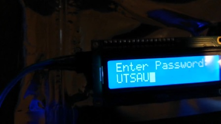

# PIC16F1829 Guessing Game

This is an implementation of a password guessing game onto a PIC16F1829 microcontroller. The user interface is shown through an LCD, which is driven by a serial communication bus, known as I2C. The program also lights up LEDs depending on the outcome of the password. 

If guessed correctly, the LED blinks green with a nice message on the LCD screen. Otherwise, the LED blinks red telling the user their "password" is incorrect.

## Directions

In order to get this by yourself, you will of course need a PIC16F1829 microcontroller with LEDs wired up accordingly.

I would also recommend the use of MPLAB X IDE, as it will make development much easier and Microchip has the relevant compilers already there for you.

## Credits

-Hi-Tech Library for providing boilerplate I2C library to drive LCD screen.

## Images

